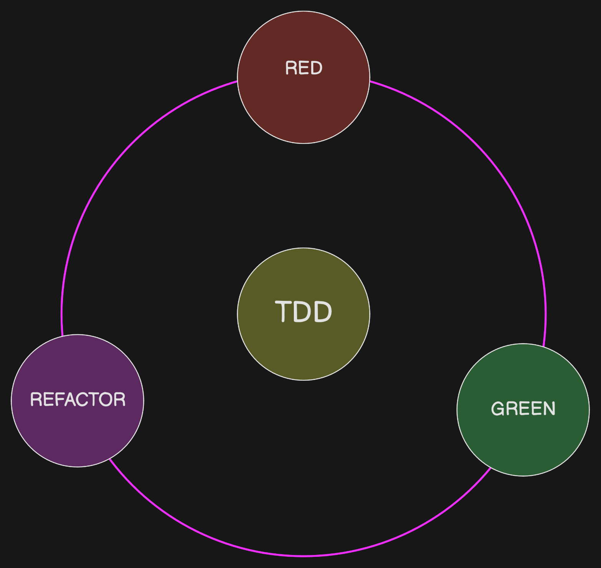
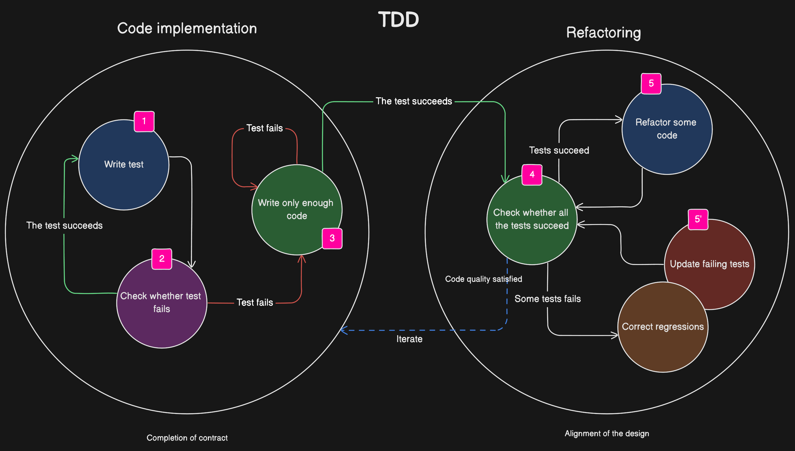

# Mastering TDD with Express.js: The Registration Endpoint 🚀

Test-Driven Development (TDD) is a revolutionary approach to software development that can transform your coding workflow, boost productivity, and enhance code quality. In this lesson, we’ll dive deep into TDD's core principles and demonstrate its power by building a registration endpoint using Express.js and TypeScript.

## The Power of TDD 🔍

**Why is TDD so impactful?**

1. **Quality Assurance**: With TDD, you’re always one step ahead of bugs. It ensures the code functions exactly as you intend.
2. **Documentation**: Your tests provide a clear understanding of what each function or feature does.
3. **Flexibility**: Refactoring becomes a breeze! Want to make changes? No problem! Your tests ensure everything still works.
4. **Confidence**: No more second-guessing. With solid tests, you know your code is dependable.

## Let's Dive In! 🌊

### Rinse and Repeat 🔄

TDD is cyclic. You’ll:

1. Write a test.
2. Implement code.
3. Refactor if needed.
4. Go back to writing the next test.

As you expand the registration endpoint, think about validation, password hashing, error handling, etc. Each new feature or logic should start with a test.

## Wrapping Up 🎁

TDD might seem counterintuitive at first. Why write tests for code that doesn't exist yet? But as you've seen, it offers clear direction, ensures robustness, and ultimately leads to superior code quality.

Happy testing! 🎉
